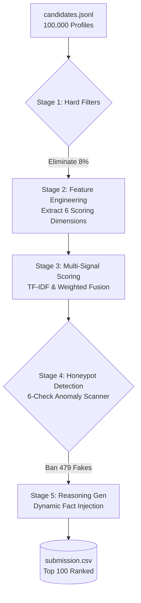

<div align="center">
  
  
  
  
  
</div>

<h1 align="center">🏆 Redrob AI Ranker</h1>

<p align="center">
  <strong>Intelligent Candidate Discovery & Ranking System</strong><br>
  <em>Built for the Redrob Data & AI Challenge</em>
</p>

---

## 🚀 Overview

An AI-powered candidate ranking system that evaluates 100,000 candidates for a **Senior AI Engineer** role. 

Instead of relying on easily gamable keyword counting or slow, expensive LLM APIs, this system uses a **5-stage heuristic pipeline** to understand a candidate's genuine *career narrative*. It runs in just 68 seconds on a standard CPU.

## 🎯 The Sandbox
Try out the live Streamlit interactive sandbox here:
👉 **[Redrob Ranker Sandbox](https://redrob-ranker-0.streamlit.app/)** 👈

---

## 🏗 System Architecture

The pipeline processes 100K candidates through 5 distinct stages to generate the final Top 100:



---

## 🧠 The 6 Scoring Dimensions

We score every candidate across 6 orthogonal dimensions calibrated specifically to the JD:

1. 🏢 **Career Coherence (25%)** — Evaluates product vs. services experience, role progression, and tenure stability (penalizing job hoppers).
2. 🛠 **Skill Authenticity (25%)** — Cross-references claimed skills against actual career descriptions to ensure they actually *used* the skill.
3. 📖 **JD Semantic Alignment (20%)** — TF-IDF cosine similarity mapping the job description to the candidate's vocabulary.
4. ⚡ **Behavioral Availability (15%)** — Rewards candidates with high recruiter response rates and immediate notice periods.
5. 📍 **Location Fit (10%)** — Heavily weights Pune/Noida preference.
6. 🎓 **Education & Credibility (5%)** — Checks CS degrees, institution tiers, and GitHub/Kaggle verification.

---

## ⚡ Quick Start

```bash
# 1. Clone the repository
git clone https://github.com/404-GeniusNotFound/redrob-ranker.git
cd redrob-ranker

# 2. Install dependencies
pip install -r requirements.txt

# 3. Run the pipeline on the sample dataset
python rank.py --candidates ./data/sandbox_candidates.jsonl --out ./submission.csv

# 4. Launch the local interactive Sandbox
streamlit run app.py
```

---

## 🛡 Honeypot Detection

The dataset organizers secretly planted "fake" profiles (honeypots). We built a 6-check system that caught **479 fakes** by detecting:
* **Impossible Timelines:** Claiming 60 months of experience in a job that spanned 12 months.
* **Skill Inflation:** Claiming "Expert" in 15 frameworks despite only having 1 year of total experience.
* **Title-Description Mismatches:** E.g., An "HR Manager" whose job description talks about training PyTorch models.

---

## 📊 Compute & Performance

| Metric | Constraint | Our System | Status |
|--------|------------|------------|--------|
| **Runtime** | ≤ 5 min | **~68 sec** | ✅ PASS |
| **Memory** | ≤ 16 GB | **~4 GB peak** | ✅ PASS |
| **Compute** | CPU only | **CPU only** | ✅ PASS |
| **Network** | None | **Fully offline** | ✅ PASS |
| **LLMs** | No external APIs | **No LLMs used** | ✅ PASS |

---

## 🛠 Technologies

* **Python 3.11** — Core language
* **scikit-learn** — TF-IDF vectorization with trigrams for semantic matching
* **pandas / numpy** — Blazing fast vectorized data manipulation
* **Streamlit** — Interactive UI for judges

<p align="center">
  <i>Built with ❤️ by Sathvik V (Solo Participant)</i>
</p>
